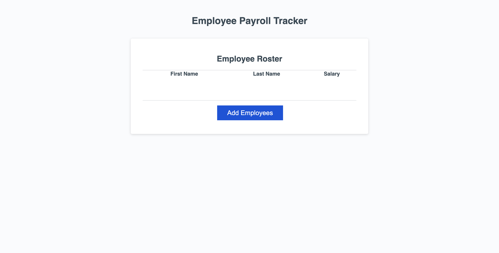

# employee-payroll-tracker

This application allows user to manage employee data. Users can collect employee information, calculate average salaries, and even select random employees for various purposes.

## Features

- Collect Employee Data: Enter First Name, Last Name, and Salary.

- Create an array of Employee Objects: Gather user input to create an array of employee objects.

- Log Average Salary: Calculate and display the average salary of all employees.

- Select Random Employee: Randomly select an employee from the list.

- Display Random Employee: Log First and Last name of the randomly selected employee.

## Usage

1. Run the program and follow the prompts to input employee details and repeat this step as needed.

2. Once all employee data is collected, the program will create an array of employee objects based on the provided details.

3. Then the program will automatically calculate and logs the average salary in console. 

4. The program also randomly picks an employee as a winner and logs the details in console. 

## Webpage visual look

## Contributing

Contributions are welcome! If you find any bugs or have suggestions for improvement, please open an issue or create a pull request.

[Live URL](https://sonusubedi-01.github.io/employee-payroll-tracker)

[GitHub Repository](https://github.com/sonusubedi-01/employee-payroll-tracker)

